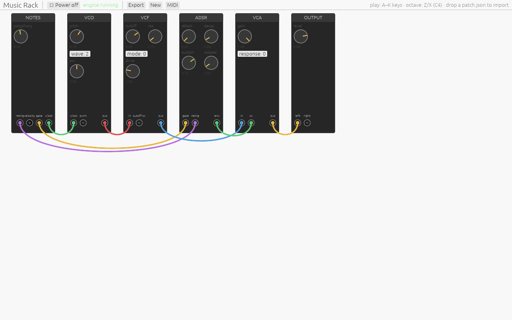

# Music Rack

A VCV Rack-style modular synthesizer that runs entirely in the browser. The
whole app is Rust compiled to WebAssembly: an egui rack UI on canvas, and a
pure-Rust DSP engine running inside a Web Audio AudioWorklet. The only
hand-written JavaScript is the worklet bootstrap shim.



## Features

- **Modules**: note input (polyphonic voice allocator), VCO (polyBLEP
  saw/square, integrated triangle, sine), VCF (Simper trapezoidal SVF,
  LP/BP/HP + drive), VCA, ADSR, LFO, 4-channel mixer, stereo output.
- **Module catalog** (grouped in the right-click add menu):
  - *Sources*: note input, VCO, macro oscillator (Plaits-style: VA / wavefolder / FM / additive / chord / particle models with HARMONICS·TIMBRE·MORPH + main/aux outs), wavetable oscillator (morphs sine→tri→saw→square), 2-op FM oscillator, additive oscillator, sub oscillator (±1/2 octaves), supersaw (7 detuned saws), chord oscillator (maj/min/7ths/sus), Karplus-Strong pluck, modal resonator, wavefolder, drum voice (kick/snare/hat), noise (white/pink)
  - *Shapers & timbre*: VCF (SVF), Moog ladder filter, low-pass gate (vactrol-style ping), multi-out SVF (LP/BP/HP/notch), auto-wah (envelope-following), dual stereo filter (L/R spread), VCA, waveshaper, saturator, ring modulator, bit crusher, Karplus-Strong comb, formant/vowel filter
  - *Modulation*: ADSR, LFO, complex LFO (4 phase taps), Maths-style function generator, sample & hold, track & hold, random (stepped + smooth), envelope follower
  - *Sequencing & timing*: clock (with /2, /4), clock divider (÷2/4/8/16), clock multiplier (×2/3/4), 8-step sequencer, arpeggiator (up/down/up-down/random + octaves), Euclidean sequencer, beats (4-track × 16-step clickable drum grid), ratchet sequencer, Turing machine, Bernoulli gate, burst/ratchet, clock-synced phasor, quantizer (chromatic/major/minor/pentatonic)
  - *Pitch & CV*: CV mixer / precision adder, octave/transpose, quantizer, slew limiter, comparator (Schmitt), rectify/min-max, DC offset / scale, min-max-mean combiner
  - *Utilities & routing*: mixer, mult/splitter, attenuverter, gate logic (AND/OR/XOR), sequential switch, crossfader, 4-channel VCA bank, gate delay, trigger tool, MIDI-CC→CV
  - *Effects & output*: delay, tape delay (wow/flutter), ping-pong delay, reverb (Freeverb-style, stereo), shimmer reverb (octave-up feedback), chorus, flanger, phaser, tremolo, vibrato, parametric EQ, stereo output
  - *Drive & dynamics*: drive (tube/diode/fuzz/fold), saturator, compressor, limiter, transient shaper, sidechain ducker, noise gate
  - *Pitch & spectral FX*: granular pitch shifter (±24 st), Bode frequency shifter, 14-band vocoder
  - *Meters & scopes*: oscilloscope (large auto-scaling waveform of a wire), spectrum analyzer (DFT magnitude bars), voltmeter (numeric CV readout), tuner (autocorrelation pitch → note name); plus the per-module scope + peak LED on every panel
  - *Deferred (research-grade, planned)*: granular texture processor (Clouds), spectrum analyzer, performance sequencer, and a sampler that loads audio files (needs a file-upload UI).
- **Live scope feedback**: every module panel shows a mini oscilloscope of
  its output and a peak LED (green→amber→red), fed by ~30 Hz meter snapshots
  from the audio engine — handy on the mixer and waveshaper.
- **Polyphonic cables**, VCV-style: up to 16 channels per cable, mono inputs
  broadcast, channel counts propagate through the graph. Voice stealing takes
  the oldest note and emits a retrigger pulse.
- **Live patching**: add/remove modules (right-click rack to add, click a
  module then Delete/Backspace to remove) and drag cables while audio runs.
  The UI flattens the graph to an execution plan on the main thread; the
  audio thread swaps plans between quanta without allocating.
- **Editing & shortcuts**: multi-select (Shift/Ctrl-click or box-drag),
  copy/paste/duplicate a whole group with its internal cables and exact
  settings (Ctrl/⌘+C / V / D), undo/redo (Ctrl/⌘+Z / +Y, or toolbar buttons),
  and a `?` overlay listing every key and mouse action.
- **Custom modules**: select any group of modules, "Save as custom…", and it
  becomes a reusable building block under **Add ▸ Custom**. Instantiating one
  drops it in *compacted* — a single collapsed box, not a sprawl of loose
  modules — with the internal cables and exact settings intact, plus the I/O
  interface you designed for it (see below). Saved to localStorage; the format
  references kinds/ports/params by name so customs survive catalog changes.
- **Groups (nested boxes)** with a hand-picked interface: select modules and
  **Group** (Ctrl/⌘+G) to fold them into one box that behaves like a preset
  module. By default the box exposes the ports that cross the group boundary,
  but you choose its real I/O: expand the group, right-click any member port,
  and "Expose on group" / "Remove from group I/O" — including ports with
  nothing wired to them yet, so you can publish an input/output the way a
  built-in module does. The same applies to controls: right-click any member
  knob or switch to surface it on the box, so the parts you tweak stay live
  without expanding. A BEATS module's whole step grid can be surfaced too
  (right-click its title ▸ "Show grid on group"), so a packaged drum group
  shows its pattern grid right on the collapsed box. Exposed ports show a blue
  ring, exposed knobs a blue tag.
  Collapsed, the box wears the same panel palette as a built-in module — peak
  LED, a live wave viewer of its exposed output, and the exposed knobs laid out
  in the param area — so a group reads as one module, not a special case.
  Double-click to expand, right-click the box to collapse or ungroup, drag it
  to move the whole group. Groups are UI-only (the audio engine stays flat);
  the whole interface (ports and knobs) saves with the patch, rides along into
  saved customs, and undoes normally.
- **Computer-keyboard piano** (A–K = C major octave, W/E/T/Y/U = sharps,
  Z/X = octave shift) and **Web MIDI** input (Chrome/Edge).
- **Patch save/load**: autosaved to localStorage, Export downloads JSON,
  drop a `patch.json` onto the window to import.
- Feedback patches are legal: back-edges read the previous 32-frame block
  (~0.67 ms at 48 kHz).

Voltage conventions follow VCV: ±5 V audio, 0–10 V unipolar CV, 10 V gates,
1 V/oct pitch with 0 V = C4.

## Build

Requires Rust (stable, `wasm32-unknown-unknown` target) and
[wasm-pack](https://rustwasm.github.io/wasm-pack/).

```sh
wasm-pack build crates/worklet --target web --out-dir web/worklet --no-typescript
wasm-pack build crates/app     --target web --out-dir web/app     --no-typescript
```

Serve `web/` with any static file server (no special headers needed):

```sh
cd web && python3 -m http.server 8123
```

Open `http://localhost:8123/app.html`, hit **⏻ Power on**, and play A–K.
(`index.html` is a minimal engine smoke-test page with an RMS meter.)

## Architecture

```
crates/
├── core     # shared vocabulary: caps, POD control messages, plan wire
│            #   format, module descriptors (ports/params by name)
├── dsp      # pure DSP, no deps: polyBLEP, trapezoidal SVF, ADSR segments,
│            #   smoothers, fast exp2/tanh, denormal guards
├── engine   # module implementations + plan executor (fixed slot pool,
│            #   port-buffer pool, double-buffered plans; no alloc/panic in
│            #   the audio path)
├── graph    # UI-side patch document + planner (topo order via reverse
│            #   postorder, persistent slot/buffer assignment) + serde JSON
├── worklet  # wasm-bindgen wrapper instantiated inside the AudioWorklet
└── app      # eframe/egui app: rack UI, audio bootstrap, keyboard, MIDI,
             #   patch IO
```

Two separate wasm artifacts are instantiated from the same engine crates. The
UI thread owns the patch and sends plans/params/notes to the worklet via
`port.postMessage` with transferable ArrayBuffers (one batch per frame); the
worklet's `onmessage` runs on the render thread between quanta, so plan swaps
need no locks. See `web/worklet-shim.js` for the (deliberately synchronous)
wasm instantiation path — async instantiation is unreliable in
AudioWorkletGlobalScope, and compiled-Module cloning silently fails there.

## Tests

```sh
cargo test        # 68 native tests: DSP correctness (FFT alias floors, SVF
                  # frequency response), graph/planner, executor, wire-format
                  # roundtrips, end-to-end poly voice rendering
node web/smoke-test.mjs   # instantiates the real worklet wasm in Node
```

Browser-level tests (power-on, cable drag, keyboard piano, persistence) live
in `web/tests/` and drive a headless Chromium via `playwright-core`; they
assert on `window.__rackState` / `__rackCables` / `__rackNotes` hooks the app
exposes.

## Roadmap

- Meters/scope fed back from the engine (upgrade transport to a
  SharedArrayBuffer ring if postMessage gets chatty)
- Sample-accurate intra-block note timing (wire format already carries frame
  offsets)
- More modules: sequencer, clock, delay, reverb, sample & hold
- Poly cable thickness/badges, all-notes-off panic button
